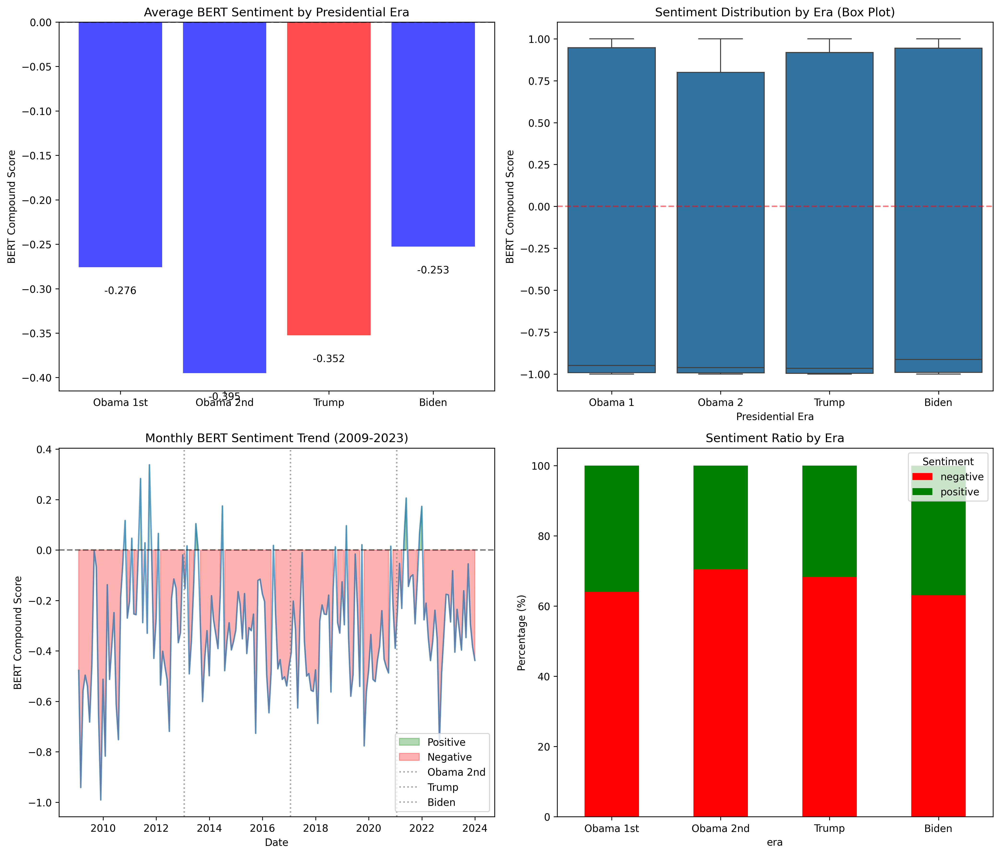
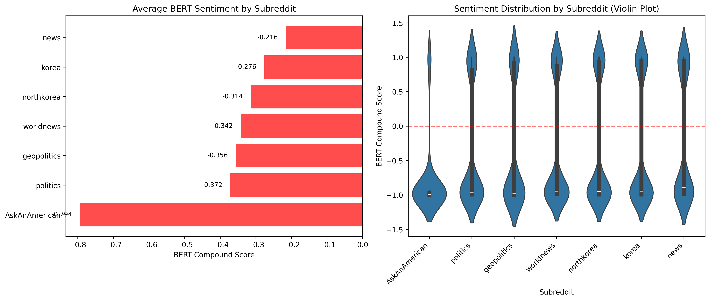
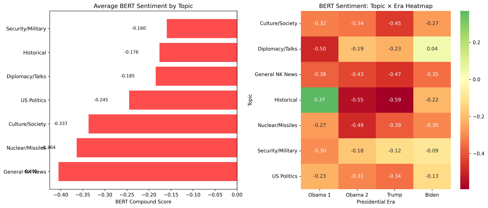
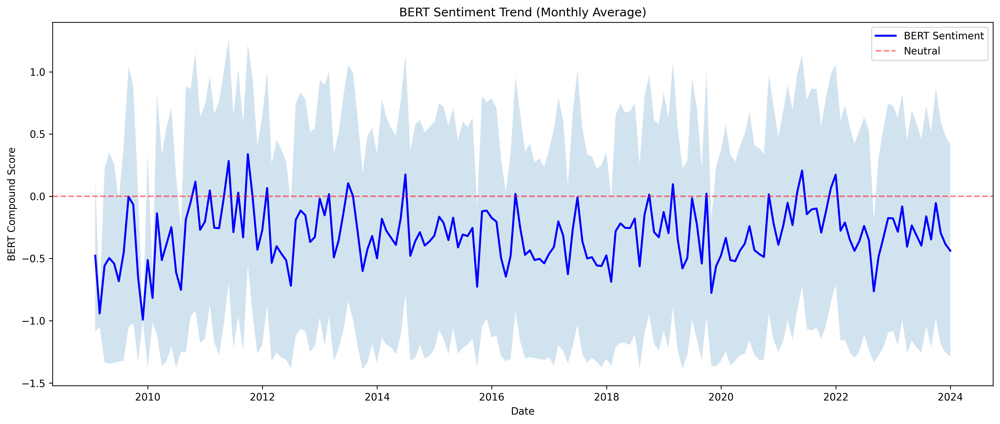
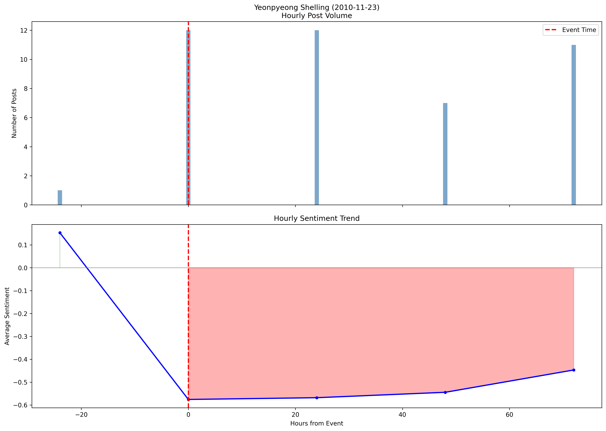
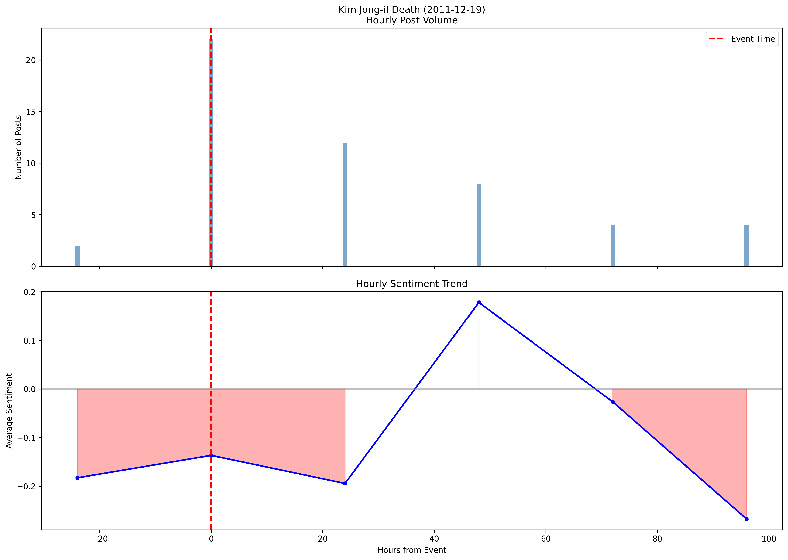
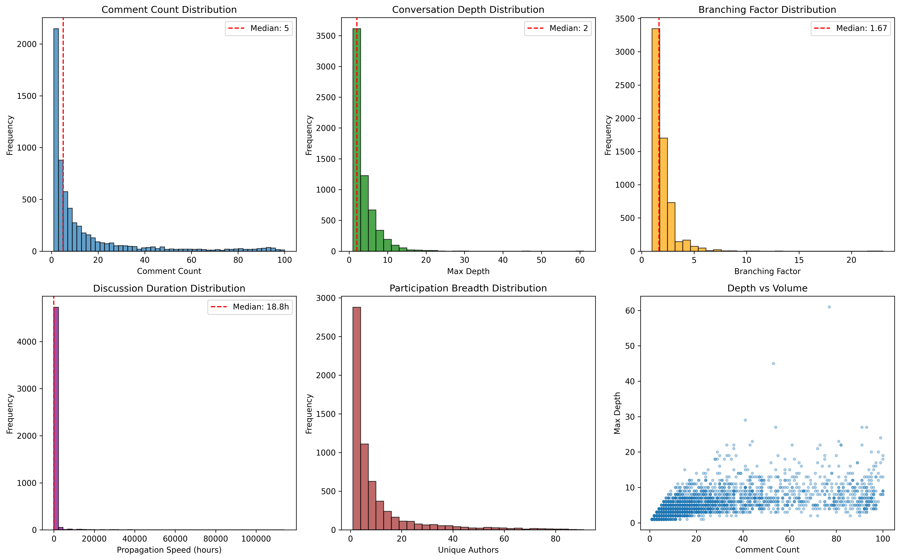
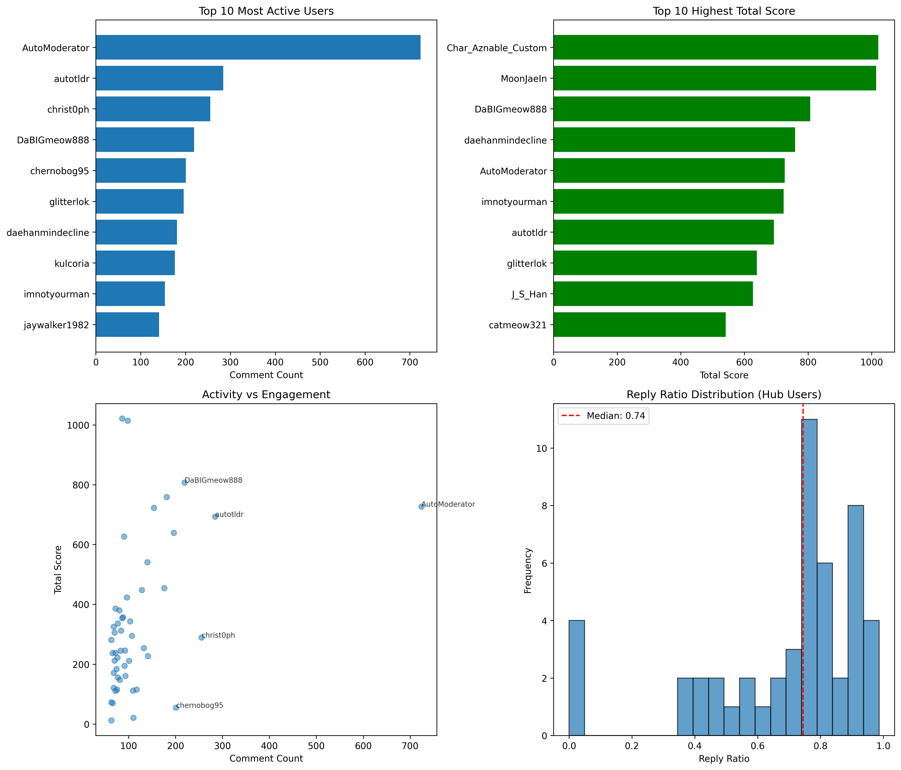
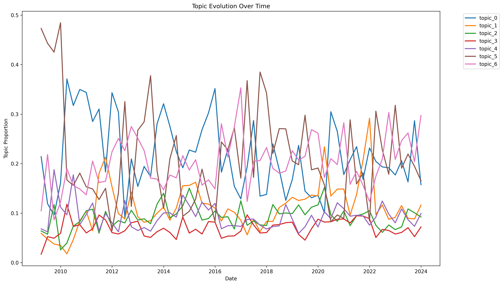
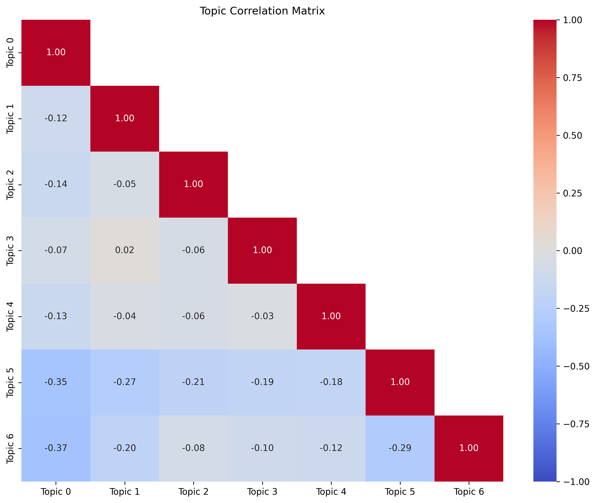

# Reddit US-NK Analysis
## 15-Year Longitudinal Discourse Analysis (2009-2023)

[](https://www.python.org/downloads/)
[](https://opensource.org/licenses/MIT)

This project analyzes U.S. public perception of North Korea, the U.S.-ROK alliance, and Korean Peninsula security issues through Reddit discourse across four presidential administrations.

---

## Executive Summary

### Key Findings
- **Obama 2nd term (2013-2016)** showed the most negative sentiment (-0.395)
- **r/AskAnAmerican** has 90.5% negative posts - reflecting direct public opinion
- **Yeonpyeong Shelling (2010)** caused the largest sentiment drop (-0.688)
- Statistically significant differences between presidential eras (p < 0.001)

### Dataset Scale
| Metric | Count |
|--------|-------|
| Posts | 10,442 |
| Comments | 88,891 |
| Time Period | 2009-2023 (15 years) |
| Subreddits | 7 |
| Presidential Eras | 4 |

---

## Dataset Overview

### Distribution by Presidential Era
| Era | Posts | Percentage |
|-----|-------|------------|
| Obama 1st (2009-2012) | 2,087 | 20.0% |
| Obama 2nd (2013-2016) | 3,105 | 29.7% |
| Trump (2017-2020) | 2,087 | 20.0% |
| Biden (2021-2023) | 3,163 | 30.3% |

### Distribution by Subreddit
| Subreddit | Description | Posts |
|-----------|-------------|-------|
| r/korea | General Korea topics | 2,322 |
| r/northkorea | NK-focused discussion | 2,215 |
| r/worldnews | International news | 2,121 |
| r/politics | US politics | 1,407 |
| r/news | General news | 1,303 |
| r/geopolitics | International relations analysis | 875 |
| r/AskAnAmerican | Q&A with Americans | 199 |

---

## Analysis Results

### 1. BERT Sentiment Analysis

#### Sentiment by Presidential Era


| Era | Mean Score | Negative % | Posts |
|-----|------------|------------|-------|
| Obama 1st (2009-2012) | -0.276 | 64.0% | 2,087 |
| **Obama 2nd (2013-2016)** | **-0.395** | **70.5%** | 3,105 |
| Trump (2017-2020) | -0.352 | 68.3% | 2,087 |
| Biden (2021-2023) | -0.253 | 63.2% | 3,163 |

**Statistical Significance**: Kruskal-Wallis H = 75.81, p < 0.001

#### Sentiment by Subreddit


| Subreddit | Mean Score | Negative % | Notes |
|-----------|------------|------------|-------|
| **r/AskAnAmerican** | **-0.794** | **90.5%** | Direct public opinion |
| r/politics | -0.372 | 69.3% | US political discourse |
| r/geopolitics | -0.356 | 68.2% | Expert analysis |
| r/worldnews | -0.342 | 67.8% | News-focused |
| r/northkorea | -0.314 | 66.3% | NK specialists |
| r/korea | -0.276 | 64.2% | Korea general |
| r/news | -0.216 | 61.2% | Neutral reporting |

#### Sentiment by Topic


| Topic | Mean Score | Negative % | Posts |
|-------|------------|------------|-------|
| **General NK News** | **-0.405** | **70.8%** | 2,883 |
| Nuclear/Missiles | -0.364 | 68.9% | 3,696 |
| Culture/Society | -0.337 | 66.6% | 587 |
| US Politics | -0.245 | 62.7% | 1,111 |
| Diplomacy/Talks | -0.185 | 60.0% | 230 |
| Historical | -0.176 | 60.4% | 245 |
| Security/Military | -0.160 | 58.5% | 1,690 |

#### Monthly Sentiment Trend


---

### 2. BERTopic (Topic Modeling)

**59 topics discovered** using BERTopic with all-MiniLM-L6-v2 embeddings.

#### Interactive Visualizations
- [Topic Clusters (2D)](outputs/figures/bertopic_clusters.html)
- [Topic Hierarchy](outputs/figures/bertopic_hierarchy.html)
- [Topic Barchart](outputs/figures/bertopic_barchart.html)
- [Topics Over Time](outputs/figures/bertopic_over_time.html)
- [Topic Heatmap](outputs/figures/bertopic_heatmap.html)

---

### 3. Event Analysis (17 Key Events)


#### Top Events by Sentiment Impact
| Event | Date | Era | Posts | Sentiment Change |
|-------|------|-----|-------|------------------|
| **Yeonpyeong Shelling** | 2010-11-23 | Obama | 43 | **-0.688** |
| NK 3rd Nuclear Test | 2013-02-12 | Obama | 7 | -0.556 |
| Hanoi Summit Failure | 2019-02-28 | Trump | 2 | -0.518 |
| Fire and Fury Speech | 2017-08-08 | Trump | 7 | -0.378 |
| Hwasong-17 ICBM Test | 2022-03-24 | Biden | 19 | +0.348 |
| NK 6th Nuclear Test | 2017-09-03 | Trump | 29 | +0.196 |

#### Hourly Analysis Examples
| Yeonpyeong Shelling | Kim Jong-il Death |
|---------------------|-------------------|
|  |  |

---

### 4. Network Analysis



#### Comment Tree Metrics
| Metric | Value |
|--------|-------|
| Posts Analyzed | 6,260 |
| Avg Comment Depth | 3.2 levels |
| Avg Branching Factor | 1.8 |
| Avg Comments/Post | 13.7 |

#### Top 10 Hub Users


| Rank | User | Comments | Avg Score | Reply Ratio |
|------|------|----------|-----------|-------------|
| 1 | AutoModerator | 724 | 1.0 | 0.7% |
| 2 | autotldr | 284 | 2.4 | 0% |
| 3 | christ0ph | 255 | 1.1 | 71.4% |
| 4 | DaBIGmeow888 | 219 | 3.7 | 92.2% |
| 5 | chernobog95 | 201 | 0.3 | 89.1% |
| 6 | glitterlok | 196 | 3.3 | 74.5% |
| 7 | daehanmindecline | 181 | 4.2 | 49.2% |
| 8 | kulcoria | 176 | 2.6 | 74.4% |
| 9 | imnotyourman | 154 | 4.7 | 74.0% |
| 10 | jaywalker1982 | 141 | 1.6 | 80.9% |

---

### 5. STM (Structural Topic Modeling)

**7 topics discovered** using LDA-based Structural Topic Modeling with document covariates.

#### STM Topics
| Topic | Top Keywords | Interpretation |
|-------|--------------|----------------|
| **Topic 0** | kim, korean, jong, kim jong, war, korean war, peninsula | Korean War & Kim Dynasty |
| **Topic 1** | pyongyang, korea, dprk, like, life, know | Daily Life in NK |
| **Topic 2** | china, dprk, chinese, news, park, propaganda, border | China-NK Relations |
| **Topic 3** | time, year, years, japanese, history, moon, food | Historical & Humanitarian |
| **Topic 4** | korean, south korean, nk, people, government, american | South Korea Politics |
| **Topic 5** | korea, nuclear, missile, missiles, test, launch, weapons | Nuclear/Missile Program |
| **Topic 6** | korea, south, north, nuclear, japan, trump, united | Diplomacy & US Policy |

#### Temporal Topic Evolution


#### Topic Correlation


---

## Methodology

### Models Used
| Task | Model | Parameters |
|------|-------|------------|
| Sentiment | DistilBERT | 66M (MPS optimized) |
| Topic Embedding | all-MiniLM-L6-v2 | 22M |
| Topic Modeling | BERTopic | UMAP + HDBSCAN |
| STM | LDA | 7 topics |

### Hardware
- Apple M4 Pro (MPS acceleration)
- Processing time: ~53 seconds for 10,442 posts

---

## Project Structure

```
reddit_US_NK/
├── README.md
├── requirements.txt
├── data/
│   ├── raw/                    # Raw JSON data
│   │   ├── reddit_posts_combined.json
│   │   └── reddit_comments_linked.json
│   └── processed/              # Processed CSV
│       ├── posts_final.csv
│       └── posts_final_bert_sentiment.csv
├── outputs/
│   └── figures/                # Visualizations
│       ├── bert_sentiment_*.png
│       ├── bertopic_*.html
│       ├── event_*.png
│       ├── network_*.png
│       └── stm_*.png
└── src/
    ├── config.py               # Configuration
    ├── data_collector.py       # Arctic Shift API
    ├── preprocessor.py         # Text preprocessing
    ├── sentiment_analyzer.py   # VADER analysis
    ├── sentiment_bert.py       # BERT analysis
    ├── topic_modeler.py        # LDA
    ├── topic_modeler_bert.py   # BERTopic
    ├── stm_analysis.py         # STM
    ├── event_analysis.py       # Event analysis
    ├── network_analyzer.py     # Network analysis
    └── misinfo_detector.py     # Gemini misinformation
```

---

## Installation

```bash
# Clone repository
git clone https://github.com/yourusername/reddit_US_NK.git
cd reddit_US_NK

# Create virtual environment
python -m venv venv
source venv/bin/activate

# Install dependencies
pip install -r requirements.txt

# For Apple Silicon (MPS)
pip install torch torchvision torchaudio
```

---

## Data Sources

| Source | Time Range | API Key |
|--------|------------|---------|
| [Arctic Shift](https://arctic-shift.photon-reddit.com/) | 2005-2023 | No |
| [PRAW](https://praw.readthedocs.io/) | 2024+ | Yes |

---

## Key Events Analyzed

| Date | Event | Type |
|------|-------|------|
| 2009-05-25 | NK 2nd Nuclear Test | Provocation |
| 2010-03-26 | Cheonan Sinking | Provocation |
| 2010-11-23 | Yeonpyeong Shelling | Provocation |
| 2011-12-19 | Kim Jong-il Death | Transition |
| 2013-02-12 | NK 3rd Nuclear Test | Provocation |
| 2016-01-06 | NK 4th Nuclear Test | Provocation |
| 2016-09-09 | NK 5th Nuclear Test | Provocation |
| 2017-08-08 | Fire and Fury Speech | Rhetoric |
| 2017-09-03 | NK 6th Nuclear Test | Provocation |
| 2017-11-29 | Hwasong-15 ICBM | Provocation |
| 2018-06-12 | Singapore Summit | Diplomacy |
| 2019-02-28 | Hanoi Summit Failure | Diplomacy |
| 2019-06-30 | DMZ Meeting | Diplomacy |
| 2022-03-24 | Hwasong-17 ICBM | Provocation |
| 2022-10-04 | NK Missile Over Japan | Provocation |
| 2023-08-18 | Camp David Summit | Diplomacy |
| 2023-11-21 | NK Satellite Launch | Provocation |

---

## Research Applications

This framework can be adapted for:
- **Longitudinal conflict discourse** (e.g., India-Pakistan, China-Taiwan)
- **Public opinion tracking** around security events
- **Cross-platform narrative comparison**
- **Event-driven sentiment analysis**

---

## Citation

```bibtex
@misc{reddit_us_nk_analysis,
  author = {Jun Sin},
  title = {Reddit Discourse on North Korea and US-ROK Alliance: 15-Year Analysis},
  year = {2024},
  publisher = {GitHub},
  url = {https://github.com/yourusername/reddit_US_NK}
}
```

---

## License

MIT License - see [LICENSE](LICENSE) for details.

---

## Acknowledgments

- [Arctic Shift](https://github.com/ArthurHeitmann/arctic_shift) - Historical Reddit data
- [PRAW](https://praw.readthedocs.io/) - Reddit API wrapper
- [BERTopic](https://maartengr.github.io/BERTopic/) - Topic modeling
- [HuggingFace Transformers](https://huggingface.co/) - BERT sentiment

---

*Created as part of research preparation for collaboration with Professor Mohit Singhal, UT Austin.*
